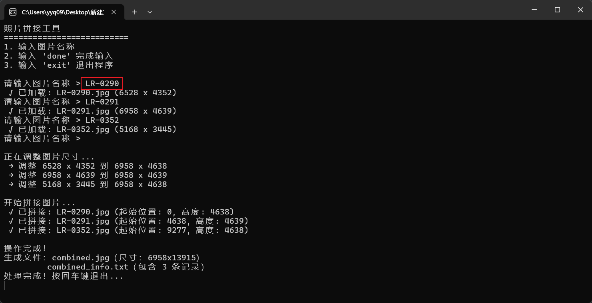
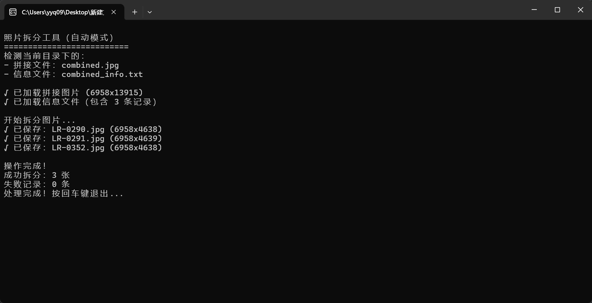
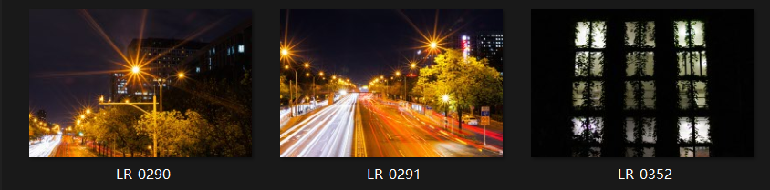

# Artistic post-processing of photos
作为一名摄影爱好者兼Python开发者，我开发了一套自动化图片处理工具，现已开源分享。这些工具能帮助摄影师快速完成常见后期处理工作，特别适合需要批量处理图片的场景。

As a photography enthusiast and Python developer, I have developed a set of automated image processing tools, which are now open source and shared. These tools can help photographers quickly complete common post-processing tasks and are particularly suitable for scenarios where batch processing of images is required.

## 工具清单与适用场景 - Tool list and applicable scenarios

### 1. 基础处理 - Basic processing
- **拼接.py**  
  
  - 功能：将多张图片拼接为全景图或网格排列图  
  - 特色：智能识别相似边缘自动对齐
  
  Splicing.py
  
  - Function: Stitch multiple images together to form a panoramic view or a grid arrangement diagram
  - Feature: Intelligent recognition of similar edges and automatic alignment
  
  **使用说明**
  
  1. 按顺序依次输入需要拼接的照片文件名，文件扩展名可以忽略  Enter the file names of the photos to be spliced in sequence. The file extensions can be ignored
  
  
  
  2. 效果展示  Effect display
  
  combined.jpg
  
  
  
  combined_info.txt
  
  ~~~
  LR-0290.jpg,0,4638
  LR-0291.jpg,4638,4639
  LR-0352.jpg,9277,4638
  ~~~
  
  
  
  **拆分.py**  
  
  - 功能：将单张大图按指定行列拆分为网格小图  
  - 应用场景：制作拼图素材、社交媒体九宫格图片  
  
  Split.py
  
  - Function: Split a single large image into grid small images according to specified rows and columns
  - Application scenarios: Creating jigsaw puzzle materials, social media nine-grid pictures
  
  **使用说明**
  
  1. 把合成后的combined.jpg和combined_info.txt放在同一文件夹下，运行`拆分.py`  Put the combined combined.jpg and combined_info.txt in the same folder and run 'split.py'
  
  
  
  2. 会自动拆分所有图片，并放到新建的文件夹中  All pictures will be automatically split and placed in a newly created folder
  
  
  
  

### 2. 版权保护 - Copyright protection
- **添加水印.py**  
  
  - 功能：添加半透明文字水印  
  
  Add watermarp.py
  
  - Function: Add semi-transparent text watermarks
  
  
  
- **添加水印和拍摄信息.py**  
  
  - 高级功能：在基础水印上叠加EXIF信息  
  - 自动读取：光圈、快门速度、感光度、焦段（需原图包含EXIF）  
  
  Add watermarks and shooting information. py
  
  Advanced feature: Superimpose EXIF information on the basic watermark
  - Automatic reading: aperture, shutter speed, ISO sensitivity, focal length (the original image must include EXIF)
  
  
  
  

### 3. 艺术化处理 - Artistic treatment
- **添加高斯背景和拍摄信息.py**  
  
  - 二合一功能：同时实现背景模糊+参数展示  
  - 特色布局：  
      - 底部10%区域显示拍摄参数  
      - 参数面板半透明渐变效果
  
  Add Gaussian background and shooting information. py
  
  Two-in-one function: Simultaneously achieve background blurring and parameter display
  - Special Layout:
  The shooting parameters are displayed in the bottom 10% area
  Semi-transparent gradient effect on the parameter panel
  

## 技术亮点 - Technical highlights

1. **智能适应系统**  
   
   - 根据图片尺寸自动计算
   - 水印文字大小
   - 水印文字的颜色
   - 扩展区域大学
   
2. **EXIF深度集成**  
   - 读取拍摄信息的核心代码
   
   "Intelligent Adaptation System：
   
   ​	Automatically calculated based on the size of the picture
   ​	Watermark text size
   ​	The color of the watermark text
   ​	Expand regional universities
   
   "EXIF Deep Integration：
   
   ​	The core code for reading the shooting information
   
   

## 使用指南 - User Guide

### 环境准备 - Environmental preparation
代码中包含`PIL、os、glob、piexif、Pillow`等依赖库

The code contains dependent libraries such as` PIL, os, glob, piexif, Pillow `, etc

### 典型工作流
1. 原始图片整理到当前目录
2. 运行处理脚本
3. 处理结果输出到当前目录的新文件夹中
4. 使用拼接.py生成作品集长图和原始图像信息文本文件

1. Organize the original images to the current directory
2. Run the processing script
3. Output the processing result to a new folder in the current directory
4. Use splicing.py to generate long images of the portfolio and text files of the original image information
